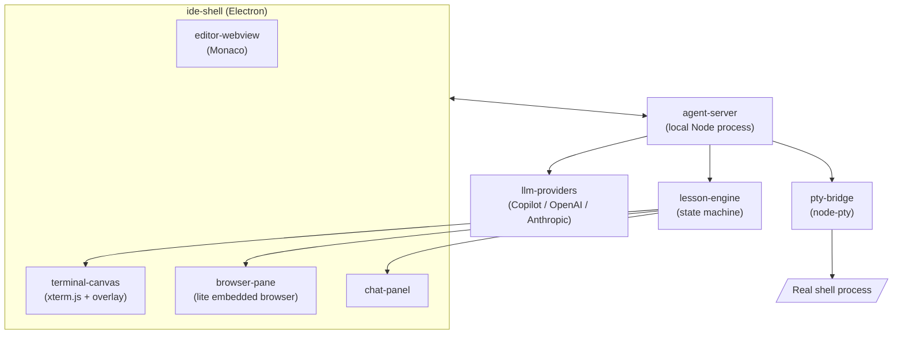

# Architecture Overview (public)

This is a high-level view safe for a public repo. Detailed interaction
design / prompting strategy lives in private, gitignored docs
(`docs/private/`) since it's the core differentiating IP of the project.

## Key design principle: overlay, don't intercept

The terminal canvas renders a **real** terminal via xterm.js + node-pty.
The agent never sits "in front of" your keystrokes or substitutes its own
command execution for yours. Instead:

1. Your input goes straight to the PTY, same as any terminal.
2. The PTY's output goes straight to xterm.js for rendering, same as any
   terminal.
3. A separate overlay layer (positioned on top, not part of the terminal
   buffer) is the only thing the agent draws on — pointers, highlights,
   callout text.
4. The lesson-engine watches the PTY output stream (read-only tap) to
   decide what to say next, but it is not in the data path between your
   keyboard and the shell.

This separation is what makes "the agent can teach me live without taking
over" structurally true rather than just a prompt instruction.

## Why a local-first agent-server

Running `agent-server` as a local process (not a hosted backend) for v1:
- Keeps "your code and terminal stay on your machine" true by
  construction, not by policy.
- Avoids hosting cost while the interaction design is still being
  validated.
- `pty-bridge` and the shell being on the same machine as the agent is
  simpler and lower-latency than any remote arrangement.

A hosted/sync variant is a possible later phase, tracked separately.

## Layer responsibilities

| Layer | Responsibility | Must NOT do |
|---|---|---|
| `editor-webview` | Render/edit files | Auto-apply agent-suggested edits without user action |
| `terminal-canvas` | Render real terminal + agent overlay | Inject synthetic input into the PTY on the agent's behalf (default off) |
| `browser-pane` | Render docs pages | Share page content without the session consent toggle being on |
| `chat-panel` | Task framing, visible lesson plan | Hide a long silent "thinking" step the user can't see progress of |
| `agent-server` | Orchestrate the above, call LLMs | Hold API keys in plaintext on disk |
| `lesson-engine` | Decide when/what to teach | Make an LLM call for every keystroke/command (cost) |
